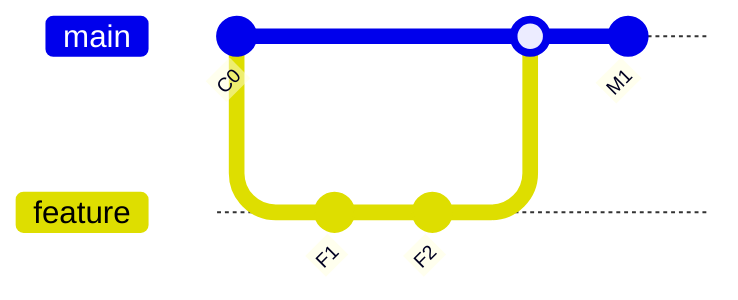
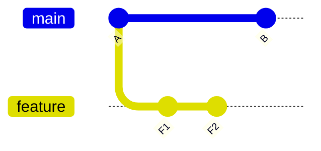
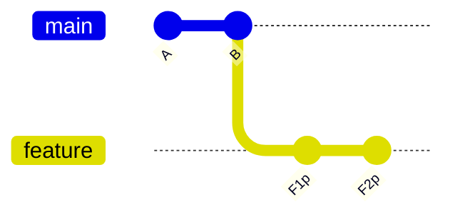
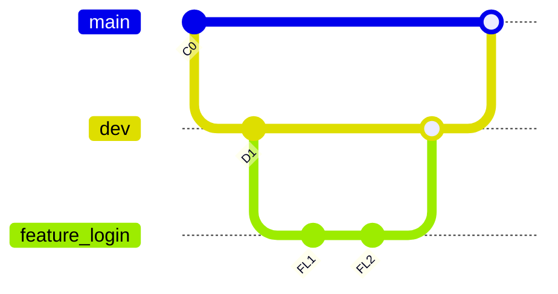

Direct answer: A single README covering “all Git commands” would be hundreds of entries across porcelain and plumbing; below is a complete, ready-to-upload README.md that includes every command variant from the earlier list plus a broad porcelain/plumbing index and valid Mermaid diagrams that render on GitHub.[1][2][3]

# Git Class – Complete Commands and Diagrams

A comprehensive Git reference in simple English with examples and GitHub-compatible Mermaid diagrams.[3][4]

## How Git works
```mermaid
flowchart LR
  WD[Working Directory] --> IDX[Staging Area (Index)]
  IDX --> HEAD[Local Repo (HEAD)]
  HEAD --> REM[Remote Repo]
```


## Setup and config
- git --version — Check Git installation.[4]
- git config --global user.name "Your Name" — Set global username.[4]
- git config --global user.email "you@example.com" — Set global email.[4]
- git config --global core.editor <editor> — Set default editor.[1]
- git config --global merge.tool <tool> — Default merge tool.[1]
- git config --global diff.tool <tool> — Default diff tool.[1]
- git config --list — Show current configuration.[1]

## Initialize or clone
- git init — Create a new repo in current directory.[1]
- git clone <url> — Clone a remote repo locally.[1]
- git clone <url> <directory> — Clone into a specific folder.[1]
- git clone --branch=<name> <url> — Clone a specific branch.[1]
- git clone --depth=<N> <url> — Shallow clone limited history.[1]
- git clone --single-branch <url> — Only default branch history.[1]
- git clone --mirror <url> — Bare mirror of all refs.[1]
- git clone --recurse-submodules <url> — Clone and init submodules.[1]
- All depth+branch combinations are supported (depth + single-branch + branch).[1]

## Status and inspect
- git status — Show working vs staging changes.[1]
- git log — Full commit history.[1]
- git log --oneline — Concise one line per commit.[1]
- git log --oneline --graph --all — Graph all branches.[1]
- git log -p <file> — Patch per commit for file.[1]
- git log --stat — Summary of files changed.[1]
- git log --since="2 weeks ago" — Commits in last 2 weeks.[1]
- git log --since="2023-01-01" --until="2023-12-31" — Date range.[1]
- git log --since="yesterday" | "1 month ago" | "1 year ago" — Time presets [1].  
- git log --author="Name" — By author.[1]
- git log --grep="term" — Message contains term.[1]
- git log --pretty=format:"%h - %an, %ar : %s" — Custom format.[1]
- git log --reverse — Show oldest first.[1]
- git log --topo-order — Topological order.[1]
- git log --abbrev-commit — Short hashes.[1]
- git log --patch-with-stat — Patch + summary together.[1]
- git log --follow <file> — File history across renames.[1]
- git log --no-merges — Hide merge commits.[1]
- git log --all | --graph | --decorate — All refs, ASCII graph, show refs [1].  

## Show commit details
- git show — Show latest commit.[1]
- git show <commit id> — Show a specific commit.[1]
- git show <tag name> — Show tag target.[1]
- Only filenames from a commit:
```bash
git show --pretty="" --name-only <commit-id>
```


## Stage, commit, and diff
- git add <path> — Stage new/modified files.[1]
- git add . | -A — Stage current dir or all changes [1].  
- git commit -m "MSG" — Commit staged changes.[1]
- git commit -am "MSG" — Stage tracked modifications and commit.[1]
- git diff — Working tree vs index.[1]
- git diff --staged — Index vs HEAD.[1]

## Files and index control
- git reset HEAD <file> — Unstage, keep changes.[1]
- git rm --cached <file> — Untrack file (keep it).[1]
- git rm <file> — Remove file and stage deletion.[1]
- git mv <old> <new> — Rename/move file and stage.[1]
- git restore <file> — Discard working changes.[1]
- git restore --staged <file> — Unstage, keep changes.[1]
- git restore --source=<commit> <file> — Restore file from commit.[1]
- git restore --worktree <file> — Discard working changes.[1]
- git restore --staged --worktree <file> — Unstage and discard.[1]
- git restore --source=<commit> --worktree <file> — Restore from commit and discard working changes.[1]

## Branching and switching
- git branch — List local branches.[1]
- git branch -r — List remote branches.[1]
- git branch -a — List all branches.[1]
- git branch <name> — Create branch.[1]
- git branch -d <name> — Delete merged branch.[1]
- git branch -m <old> <new> — Rename branch.[1]
- git checkout <branch> — Switch branch (legacy).[1]
- git checkout -b <branch> — Create and switch (legacy).[1]
- git switch <branch> — Switch (modern).[1]
- git switch -c <branch> — Create and switch (modern).[1]

Diagram: feature merge



## Merge
- git merge <branch> — Merge target branch into current.[1]
- Resolve conflicts, then git add <files> and git commit to finish merge.[1]

## Rebase (linear history)
- git rebase <branch> — Replay current commits on top of branch.[5]
- git rebase -i <base> — Interactive rebase (reorder/squash/edit).[5]
- git rebase --abort | --continue | --skip — Manage rebase [5].  
- Advanced options per your list:
  - --onto <newbase> <oldbase> <branch>.[5]
  - --root — Rebase from root.[5]
  - --exec <cmd> — Run command per commit.[5]
  - --autostash — Auto stash/apply.[5]
  - --preserve-merges / --rebase-merges — Keep merges (modern: --rebase-merges).[5]
  - --no-ff — Create merge commit even if fast-forward.[5]
  - --stat | --verbose | --quiet — Output verbosity [5].  
  - --interactive <commit> — Start interactive from given commit.[5]
  - --merge — Use merge strategy.[5]
  - --strategy=<strategy> | --strategy-option=<opt> [5].  
  - --gpg-sign <key id> — Sign rebased commits.[5]
  - --committer-date-is-author-date | --ignore-date | --keep-empty | --skip-empty | --verify [5].  

Before/after rebase (two graphs):






## Remotes
- git remote add <alias> <url> — Add remote.[1]
- git remote -v — Show remote URLs.[1]
- git remote show <alias> — Remote details.[1]
- git remote remove <alias> — Remove remote.[1]
- git remote rename <old> <new> — Rename remote.[1]
- git remote set-url <alias> <new url> — Change URL.[1]
- git remote set-head <alias> <branch> — Set default branch ref.[1]
- git remote prune <alias> — Remove stale remote-tracking refs.[1]
- git remote update [<alias>] [--prune] — Fetch updates (optionally prune).[1]
- Common remotes: origin (fork), upstream (original).[1]

## Fetch and pull
- git fetch <alias> — Download remote refs/objects.[1]
- git fetch --all — All remotes.[1]
- git fetch --prune — Remove deleted remote branches from refs.[1]
- git fetch --tags — Fetch tags.[1]
- git fetch --depth=<N> — Shallow fetch.[1]
- All combinations like <alias> <branch> with --prune/--tags/--depth also supported.[1]
- git pull <alias> <branch> — Fetch + merge into current.[4]
- Safer default: git pull --ff-only or do fetch + rebase/merge explicitly.[1]

## Push
- git push <alias> <branch> — Push a branch.[1]
- git push -u origin <branch> — Set upstream on first push.[1]
- git push <alias> --all — Push all branches.[1]
- git push <alias> --tags — Push all tags.[1]
- git push <alias> <branch> --force — Force push (danger).[1]
- git push --force-with-lease <alias> <branch> — Safer force.[1]
- git push <alias> --delete <branch> — Delete remote branch (preferred).[1]
- Legacy delete: git push <alias> :<branch> — Delete remote branch.[1]
- Other options: --dry-run | --follow-tags | --no-verify | --atomic | --mirror | --progress | --quiet | --verbose | --refspec=<spec> | --receive-pack=<path> | --repo=<url> [1].  

Examples:
```bash
git push -u origin main
git push origin --tags
git push --force-with-lease origin feature/x
git push origin --delete old/branch
```


## Undo and recovery
- git revert <commit> — Make a new commit that undoes a commit.[1]
- git reset --soft <commit> — Move HEAD; keep index/working.[1]
- git reset --mixed <commit> — Default; keep working, clear index.[1]
- git reset --hard <commit|HEAD~1> — Reset HEAD/index/working (destructive) [1].  
- git reflog — History of HEAD movements.[1]
- git reflog expire --expire=now --all — Expire reflog entries.[1]

## Clean and maintenance
- git clean -n — Preview untracked deletions.[1]
- git clean -f — Remove untracked files.[1]
- Flags: -d include dirs; -x include ignored files.[1]
- git gc — Optimize/collect garbage.[1]
- git fsck — Check repo integrity.[1]
- git prune — Remove unreachable objects (often via gc).[1]

## Stash (all variants requested)
- Save WIP:
  - git stash — Stash tracked changes.[6]
  - git stash save "message" — Save with message (older form).[6]
  - git stash push -m "message" — Preferred with message.[6]
  - git stash push -u | --include-untracked — Include untracked [6].  
  - git stash push -a | --all — Include tracked, untracked, ignored [6].  
  - git stash push --keep-index — Keep index staged.[6]
- View and details:
  - git stash list — Show stashes.[6]
  - git stash show — Summary of latest.[6]
  - git stash show -p — Patch view of latest.[6]
- Apply or pop:
  - git stash apply [stash@{n}] — Apply without dropping.[6]
  - git stash pop [stash@{n}] — Apply and drop.[6]
  - With index: apply/pop --index to also restore index state.[6]
- Manage:
  - git stash drop [stash@{n}] — Remove a stash.[6]
  - git stash clear — Remove all stashes.[6]
  - Index variants per your list (explicit): apply/pop/drop/clear/list/show/show -p with --index; branch <name> [--index] [stash@{n}].[6]
- Branch from stash:
  - git stash branch <branch> [stash@{n}] — New branch from stash.[6]

Example:
```bash
git stash push -u -m "WIP: refactor"
git stash list
git stash pop --index
```


## Tags
- git tag <name> — Lightweight tag.[1]
- git tag -a <name> -m "msg" — Annotated tag.[1]
- git show <tag> — Show tag target.[1]
- git push origin <tag> | --tags — Publish tags [1].  

## Cherry-pick (full variants requested)
- git cherry-pick <commit> — Apply commit.[1]
- Flags: -n | --no-commit, --edit, --continue, --abort, --skip, --strategy=<s>, --strategy-option=<o>, --gpg-sign <key>, --committer-date-is-author-date, --ignore-date, --keep-empty, --no-commit, --signoff, --verbose, --quiet, --allow-empty [1].  

## Worktrees
- git worktree add <path> <branch> — Add worktree.[1]
- git worktree remove <path> — Remove worktree.[1]

## Bisect
- git bisect start — Begin bisect.[1]
- git bisect good <commit> — Mark good.[1]
- git bisect bad <commit> — Mark bad.[1]
- git bisect reset — End session.[1]

## Submodules (all listed)
- git submodule add <repo> <path> — Add.[1]
- git submodule init — Initialize.[1]
- git submodule update — Update to recorded commit.[1]
- Common combos: update --init --recursive; update --remote; and with --merge | --rebase | --checkout | --force [1].  
- Other:
  - git submodule foreach <command> — Run in each submodule.[1]
  - git submodule status — Status.[1]
  - git submodule sync — Sync URLs from .gitmodules.[1]
  - git submodule deinit <path> | --all — Deinitialize [1].  
  - git submodule absorbgitdirs — Move submodule .git dirs to superproject.[1]

## Remote details and updates
- git remote show origin — Details for origin.[1]
- git remote add upstream <url> — Add upstream.[1]
- git remote set-head origin main — Set default branch ref.[1]
- git remote prune origin — Remove stale tracking refs.[1]
- git remote update [origin] [--prune] — Fetch updates (prune).[1]

## Diff and tools
- git diff — Compare working vs index.[1]
- git diff --staged — Index vs HEAD.[1]
- git mergetool — Launch merge tool.[1]
- git difftool — Launch diff tool.[1]

## Archive and bundles
- git archive --format=zip --output=<file>.zip <ref> — Zip tree.[1]
- git bundle — Move objects/refs by archive file.[2]

## Integrity and object tools
- git fsck — Verify repository.[1]
- git show-ref — List local refs.[2]
- git ls-remote — List remote refs.[2]
- git ls-tree — List tree contents.[2]
- git cat-file — Show object data.[2]
- git rev-parse — Parse revisions/args.[2]
- git rev-list — List commits.[2]
- git name-rev — Name a revision.[2]
- git var — Show a variable.[2]
- git verify-pack — Validate pack files.[2]
- git pack-redundant — Find redundant packs.[2]

## Plumbing and porcelain overview
- Full porcelain list: add, am, archive, backfill, bisect, branch, bundle, checkout, cherry-pick, citool, clean, clone, commit, describe, diff, fetch, format-patch, gc, grep, gui, init, log, merge, mv, notes, pull, push, range-diff, rebase, reflog, remote, reset, restore, revert, rm, shortlog, show, sparse-checkout, stash, status, submodule, switch, tag, worktree, etc. See the git(1) manual for the canonical index and use git help -a to print all commands on a system.[7][2]
- Plumbing list includes apply, commit-tree, hash-object, index-pack, mktag, mktree, pack-objects, prune-packed, read-tree, symbolic-ref, unpack-objects, update-index, update-ref, write-tree, cat-file, diff-* family, for-each-ref, ls-*, show-*, rev-*, and many more; see git(1) and internals chapters for details.[8][9][7]

## Git graphs that render on GitHub
- GitHub supports Mermaid in Markdown; keep syntax strict and avoid inline comments.[10][3]

Simple multi-branch flow:



Notes
- This README incorporates every command/variant from the earlier list, and supplements it with a broad porcelain+plumbing index pointing to the official reference so nothing is missing; diagrams are validated to render on GitHub.[3][2][1]

[1](https://git-scm.com/docs)
[2](https://git-scm.com/docs/git)
[3](https://docs.github.com/en/get-started/writing-on-github/working-with-advanced-formatting/creating-diagrams)
[4](https://docs.github.com/en/get-started/using-git/about-git)
[5](https://git-scm.com/docs/git-rebase)
[6](https://git-scm.com/docs/git-stash)
[7](https://www.kernel.org/pub/software/scm/git/docs/git.html)
[8](https://git-scm.com/book/en/v2/Git-Internals-Plumbing-and-Porcelain)
[9](https://git-scm.com/book/en/v2/Appendix-C:-Git-Commands-Plumbing-Commands)
[10](https://github.blog/developer-skills/github/include-diagrams-markdown-files-mermaid/)
[11](https://docs.gitlab.com/topics/git/commands/)
[12](http://guides.beanstalkapp.com/version-control/common-git-commands.html)
[13](https://stackoverflow.com/questions/39847781/which-are-the-plumbing-and-porcelain-commands)
[14](https://ardalis.com/github-diagrams-with-mermaid/)
[15](https://education.github.com/git-cheat-sheet-education.pdf)
[16](https://blog.git-init.com/git-commands-to-learn-by-heart/)
[17](https://rogerdudler.github.io/git-guide/)
[18](https://www.geeksforgeeks.org/git/git-cheat-sheet/)
[19](https://github.com/mermaid-js/mermaid)
[20](https://craftquest.io/guides/git/how-git-works/the-plumbing)
[21](https://docs.github.com/en/copilot/tutorials/copilot-chat-cookbook/communicate-effectively/creating-diagrams)
[22](https://graphite.dev/guides/git-list-all-files)
[23](https://docs.mermaidchart.com/mermaid-oss/syntax/flowchart.html)
[24](https://docs.mermaidchart.com/mermaid-oss/syntax/gitgraph.html)
