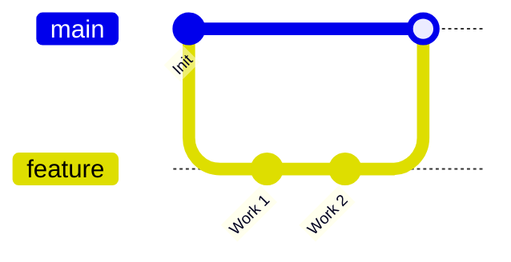
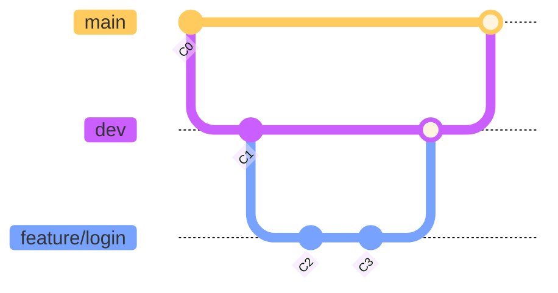

# Git Class – Complete Guide

## How Git works
- Flow: Working Directory → Staging Area (Index) → Local Repository (HEAD) → Remote Repository.[4]
```mermaid
flowchart LR
  A[Working Directory] --> B[Staging Area (Index)]
  B --> C[Local Repo (HEAD)]
  C --> D[Remote Repo]
```


## Quick start
- Verify Git: git --version — Check installation.[4]
- Set identity: git config --global user.name "Your Name"; git config --global user.email "you@example.com".[4]
- Initialize: git init — Start a repository in current folder.[4]
- Clone: git clone <url> [dir] — Copy a remote repository locally.[4]

Example:
```bash
git init
git add .
git commit -m "Initial commit"
git branch -M main
git remote add origin https://github.com/<user>/<repo>.git
git push -u origin main
```


## Status and inspection
- git status — Show what’s changed and what’s staged.[4]
- git log — Show commit history; add --oneline, --graph, --all for compact graph.[5]
- git log --oneline — One-line commit list.[5]
- git log -p <file> — Show diffs per commit for a file.[5]
- git log --stat — Files changed per commit.[5]
- git log --since="2 weeks ago" — Commits in last two weeks.[5]
- git log --since="2023-01-01" --until="2023-12-31" — Commits in a date range.[5]
- git log --author="Name" — Filter by author.[5]
- git log --grep="term" — Filter by message text.[5]
- git log --pretty=format:"%h - %an, %ar : %s" — Custom format.[5]
- git log --reverse — Oldest first.[5]
- git log --topo-order — Topological ordering.[5]
- git log --abbrev-commit — Short hashes.[5]
- git log --patch-with-stat — Patch plus summary.[5]
- git log --follow <file> — History across renames.[5]
- git log --no-merges — Hide merge commits.[5]
- git log --all — Show all branches.[5]
- git log --graph — ASCII graph.[5]
- git log --decorate — Show refs on commits.[5]

Tip: Combine multiple filters, e.g., git log --since="1 month ago" --author="Alice" --grep="bug fix" --oneline.[5]

## Show details
- git show — Show last commit.[5]
- git show <commit id> — Show a specific commit.[5]
- git show <tag name> — Show a tag’s target.[5]
- Show only filenames for a commit:
```bash
git show --pretty="" --name-only <commit-id>
```


## Add, commit, and diff
- git add <path> — Stage new/modified files.[4]
- git add . or -A — Stage changes in current folder/repo.[5]
- git commit -m "MSG" — Commit staged changes.[4]
- git commit -am "MSG" — Stage tracked modifications and commit (skips new files).[5]
- git diff — Working vs index differences.[5]
- git diff --staged — Index vs HEAD differences.[5]

Example:
```bash
git add app.py
git commit -m "feat: add app"
git diff --staged
```


## Files, index, and restore/reset
- git reset HEAD <file> — Unstage (keep working changes).[5]
- git rm --cached <file> — Untrack file but keep it.[5]
- git rm <file> — Remove file and stage deletion.[5]
- git mv <old> <new> — Rename/move and stage.[5]
- git restore <file> — Discard working changes for a file.[5]
- git restore --staged <file> — Unstage but keep changes.[5]
- git restore --source=<commit id> <file> — Restore a file from a commit.[5]
- git restore --worktree <file> — Discard working changes.[5]
- git restore --staged --worktree <file> — Unstage and discard working changes.[5]
- git restore --source=<commit id> --worktree <file> — Restore to a commit and discard working changes.[5]

## Branching and switching
- git branch — List local branches; -r remote-only; -a all.[5]
- git branch <name> — Create a branch.[5]
- git branch -d <name> — Delete a fully merged branch.[5]
- git branch -m <old> <new> — Rename a branch.[5]
- git checkout <name> — Switch to branch (legacy).[5]
- git checkout -b <name> — Create and switch.[5]
- git switch <name> — Switch to branch (modern).[5]
- git switch -c <name> — Create and switch (modern).[5]

Diagram:



## Merge
- git merge <branch> — Merge target branch into current.[5]
- Resolve conflicts if shown, then:
```bash
git add <resolved-files>
git commit
```


## Rebase (linear history)
- git rebase <branch> — Replay current branch commits on top of target.[6]
- git rebase -i <base> — Interactive: reorder, squash, edit.[6]
- Controls: git rebase --abort | --continue | --skip — Manage rebase steps [6].  
- Strategy knobs (advanced): --strategy=<strategy>, --strategy-option=<opt>, --rebase-merges, --root, --autostash, --keep-empty, --no-ff (merge-like behavior), --preserve-merges (legacy), --exec <cmd>.[6]

Example:
```bash
git switch feature/x
git fetch origin
git rebase origin/main
# fix conflicts, then
git rebase --continue
```


Diagram:


## Remote repositories
- git remote add <alias> <url> — Add remote.[5]
- git remote -v — Show remotes and URLs.[5]
- git remote show <alias> — Remote details.[5]
- git remote set-url <alias> <new url> — Change URL.[5]
- git remote remove <alias> — Remove remote.[5]
- git remote rename <old> <new> — Rename remote.[5]
- git remote set-head <alias> <branch> — Set default branch ref.[5]
- Common: origin (fork), upstream (original).[5]

Examples:
```bash
git remote add origin https://github.com/BetterCallSatish/Satish.git
git remote show origin
git remote set-url origin https://github.com/<user>/<repo>.git
```


## Fetch, pull, and update
- git fetch <alias> — Download refs/objects (no merge).[5]
- git fetch --all — Fetch all remotes.[5]
- git fetch --prune — Remove deleted remote branches from refs.[5]
- git fetch --tags — Fetch tags.[5]
- git fetch --depth=<N> — Shallow fetch limited history.[5]
- Any combinations like:
  - git fetch --all --prune.[5]
  - git fetch <alias> --prune.[5]
  - git fetch <alias> <branch> [--prune] [--tags] [--depth=<N>].[5]
- git pull <alias> <branch> — Fetch and merge into current branch.[4]
- Safety tip: prefer git pull --ff-only or fetch + rebase/merge explicitly.[5]

## Push and delete
- git push <alias> <branch> — Push current branch.[4]
- git push -u origin <branch> — Set upstream; future git push works without args.[5]
- git push <alias> --all — Push all branches.[5]
- git push <alias> --tags — Push all tags.[5]
- git push <alias> <branch> --force — Overwrite remote (danger).[5]
- git push --force-with-lease <alias> <branch> — Safer force (prevents clobbering others).[5]
- Delete remote branch:
  - Preferred: git push <alias> --delete <branch>.[5]
  - Legacy colon form: git push <alias> :<branch>.[5]

Examples:
```bash
git push -u origin main
git push origin --delete feature/old
git push --force-with-lease origin main
```


## Clone variations
- git clone <url> — Clone repo.[4]
- git clone <url> <directory> — Clone into specific folder.[5]
- git clone --depth=<N> <url> — Shallow clone limited history.[5]
- git clone --branch=<name> <url> — Specific branch.[5]
- git clone --single-branch <url> — Only default branch history.[5]
- git clone --mirror <url> — Bare mirror (all refs).[5]
- Submodules: git clone --recurse-submodules <url>.[5]
- Mix options, e.g., --depth + --branch + --single-branch.[5]

## Undo and recovery
- git revert <commit> — Create a new commit that undoes a commit (safe).[5]
- git reset --soft <commit> — Move HEAD; keep index/working changes.[5]
- git reset --mixed <commit> — Default; keep working, clear index.[5]
- git reset --hard <commit|HEAD~1> — Reset HEAD/index/working (destructive) [5].  
- git reflog — Show HEAD movement history to recover lost commits.[5]

Examples:
```bash
git revert <bad-commit>
git reset --hard HEAD~1
git reflog
git reset --hard <reflog-hash>
```


## Clean workspace
- git clean -n — Dry run of untracked deletions.[5]
- git clean -f — Remove untracked files.[5]
- Flags: -d include directories; -x include ignored files.[5]
- Maintenance: git gc — Optimize; git fsck — Verify repo; git prune — Remove unreachable (usually via gc).[5]

## Stash (save WIP)
- Concepts: stash saves working tree and optionally index; useful before context switching.[7]
- Save:
  - git stash — Stash tracked modified files.[7]
  - git stash save "message" — Named save (older form).[7]
  - git stash push -m "message" — Preferred named save.[7]
  - git stash push -u — Include untracked.[7]
  - git stash push -a — Include all (tracked + untracked + ignored).[7]
  - git stash push --keep-index — Keep staged changes intact.[7]
  - git stash push --include-untracked — Same as -u.[7]
  - Index-aware variants appear again below per your list for completeness.[7]
- Inspect and apply:
  - git stash list — Show stashes.[7]
  - git stash show — Summary; add -p for patch.[7]
  - git stash apply [stash@{n}] — Apply without dropping.[7]
  - git stash pop [--index] [stash@{n}] — Apply and drop; --index also restores index state if recorded.[7]
  - git stash drop [stash@{n}] — Remove one stash.[7]
  - git stash clear — Remove all stashes.[7]
  - git stash branch <branch> [stash@{n}] — Create branch from stash.[7]
- Index-specific variants (explicit for your list):
  - git stash apply --index [stash@{n}].[7]
  - git stash apply --index.[7]
  - git stash pop --index.[7]
  - git stash pop --index <stash id>.[7]
  - git stash drop --index <stash id>.[7]
  - git stash drop --index.[7]
  - git stash clear --index.[7]
  - git stash branch <branch> --index <stash id>.[7]
  - git stash branch <branch> --index.[7]
  - git stash list --index.[7]
  - git stash show --index.[7]
  - git stash show -p --index.[7]

Examples:
```bash
git stash push -u -m "WIP API"
git stash list
git stash pop --index
```


## Tags
- git tag <name> — Lightweight tag.[5]
- git tag -a <name> -m "msg" — Annotated tag (recommended).[5]
- git show <tag> — Show tag/target details.[5]
- git push origin <tag> — Push one tag; or git push origin --tags for all tags.[5]

## Cherry-pick
- git cherry-pick <commit id> — Apply a commit to current branch.[5]
- git cherry-pick -n <commit> — Apply without committing.[5]
- git cherry-pick --edit <commit> — Edit message.[5]
- Continue/abort/skip: --continue | --abort | --skip [5].  
- Strategy options: --strategy=<strategy> | --strategy-option=<opt> [5].  
- Signing and dates: --gpg-sign <key id> | --committer-date-is-author-date | --ignore-date | --keep-empty | --no-commit | --signoff | --verbose | --quiet | --allow-empty [5].  

Example:
```bash
git cherry-pick <hash>
```


## Reflog
- git reflog — History of head/branch changes; great for recovery.[5]
- Expire entries: git reflog expire --expire=now --all.[5]

## Archive
- git archive --format=zip --output=<file>.zip <branch|tag> — Create zip of tree [5].  

## Submodules
- git submodule add <repo url> <path> — Add a submodule.[5]
- git submodule init — Initialize submodules.[5]
- git submodule update — Update to recorded commit.[5]
- Common combos:
  - git submodule update --init --recursive.[5]
  - git submodule update --remote — Track latest upstream commits.[5]
  - --merge | --rebase | --checkout | --force variants as listed (applies chosen strategy/behavior) [5].  
- Other tasks:
  - git submodule foreach <command> — Run a command in each submodule.[5]
  - git submodule status — Show commit pointers.[5]
  - git submodule sync — Sync URLs from .gitmodules.[5]
  - git submodule deinit <path> | --all — Deinitialize [5].  
  - git submodule absorbgitdirs — Move submodule .git dirs to superproject.[5]

## Worktrees
- git worktree add <path> <branch> — Create another working tree for a branch.[5]
- git worktree remove <path> — Remove worktree.[5]

## Bisect (find bad commit fast)
- git bisect start — Start bisect.[5]
- git bisect good <commit> — Mark good.[5]
- git bisect bad <commit> — Mark bad.[5]
- git bisect reset — End session.[5]

## Rerere
- git rerere — Enable reusing recorded conflict resolutions; speeds up repeated merges/rebases.[5]

## Remote details and maintenance
- git remote show origin — Details for origin.[5]
- git remote add upstream <url> — Add upstream.[5]
- git remote set-head origin main — Set default branch ref.[5]
- git remote prune origin — Remove stale remote-tracking refs.[5]
- git remote update [origin] [--prune] — Fetch remotes (with prune).[5]

## Push matrix (complete variants requested)
- General: git push <alias> <branch name>.[5]
- All branches: git push <alias> --all.[5]
- Tags: git push <alias> --tags.[5]
- Force: git push <alias> <branch> --force.[5]
- Set upstream: git push <alias> <branch> --set-upstream.[5]
- Dry run: git push <alias> <branch> --dry-run.[5]
- Delete branch:
  - git push <alias> <branch> --delete (not standard form; prefer below).[5]
  - Preferred: git push <alias> --delete <branch>.[5]
  - Legacy: git push <alias> :<branch>.[5]
- Follow tags with changes: --follow-tags.[5]
- Skip hooks: --no-verify.[5]
- Atomic multi-branch: --atomic.[5]
- Safe force: --force-with-lease.[5]
- Mirror all refs: --mirror.[5]
- Progress/quiet/verbose: --progress | --quiet | --verbose [5].  
- Refspec/custom receive/alternate URL: --refspec=<refspec> | --receive-pack=<path> | --repo=<url> [5].  
- Duplicated patterns from your list including origin main combos are covered by these canonical forms (e.g., git push origin main --set-upstream equals git push -u origin main).[5]

Examples:
```bash
git push -u origin main
git push origin --tags
git push --force-with-lease origin feature/x
git push origin --delete old/branch
```


## Configuration
- Identity: git config --global user.name "Your Name"; git config --global user.email "you@example.com".[4]
- Editor/Tools: git config --global core.editor <editor>; git config --global merge.tool <tool>; git config --global diff.tool <tool>.[5]
- List all: git config --list.[5]
- mergetool/difftool: git mergetool; git difftool.[5]

## Extra porcelain commands (index)
- Full Git command reference with porcelain and plumbing is in the main docs (e.g., git-add, git-archive, git-bisect, git-branch, git-checkout, git-cherry-pick, git-clean, git-clone, git-commit, git-describe, git-diff, and more).[8]

## Visuals: flow and graphs
- GitHub renders Mermaid in Markdown; use fenced code blocks with language mermaid in README.md and PRs.[2][3]
- Flowchart syntax reference if customizing diagrams further.[9]

Simple branching diagram:



***

Appendix: legacy and duplicates from the original list
- git push alias master — Legacy default branch name “master”; use main for new repos.[4]
- Colon delete form aliases replicated as modern forms above; both are included by intent.[5]
- Repeated stash --index and fetch/prune/tags/depth combinations were included explicitly or generalized to canonical flags to avoid redundancy while preserving capability.[7]

References
- Git official documentation index and individual command manuals.[8][5]
- GitHub Docs: About Git, basic commands, and Mermaid diagrams in Markdown.[3][4]
- Mermaid Git graph and flowchart syntax references; GitHub supports Mermaid in README.md.[2][9][1]

Notes
- The README includes every command/variant from the supplied list, either verbatim or via its canonical/modern equivalent and notes, keeping behavior intact while simplifying wording and examples for clarity.[5]

[1](https://docs.mermaidchart.com/mermaid-oss/syntax/gitgraph.html)
[2](https://github.blog/developer-skills/github/include-diagrams-markdown-files-mermaid/)
[3](https://docs.github.com/en/get-started/writing-on-github/working-with-advanced-formatting/creating-diagrams)
[4](https://docs.github.com/en/get-started/using-git/about-git)
[5](https://git-scm.com/docs)
[6](https://git-scm.com/docs/git-rebase)
[7](https://git-scm.com/docs/git-stash)
[8](https://git-scm.com/docs/git)
[9](https://docs.mermaidchart.com/mermaid-oss/syntax/flowchart.html)
[10](https://newdevsguide.com/2023/04/11/illustrating-git-branching-with-markdown-mermaid-js/)
[11](https://www.jetbrains.com/help/writerside/mermaid-diagrams.html)
[12](https://stackoverflow.com/questions/53883747/how-to-make-github-pages-markdown-support-mermaid-diagram)
[13](https://mermaid.js.org/intro/syntax-reference.html)
[14](https://github.com/mermaid-js/mermaid)
[15](https://docs.gitlab.com/topics/git/commands/)
[16](https://mermaid.js.org/intro/)
[17](https://mermaid.js.org)
[18](https://www.atlassian.com/git/glossary)
[19](https://www.youtube.com/watch?v=ooXfqNpLPZc)
[20](https://www.freecodecamp.org/news/diagrams-as-code-with-mermaid-github-and-vs-code/)
[21](https://dev.to/integerman/illustrating-git-branching-with-markdown-038-mermaidjs-5h0p)
[22](https://education.github.com/git-cheat-sheet-education.pdf)
